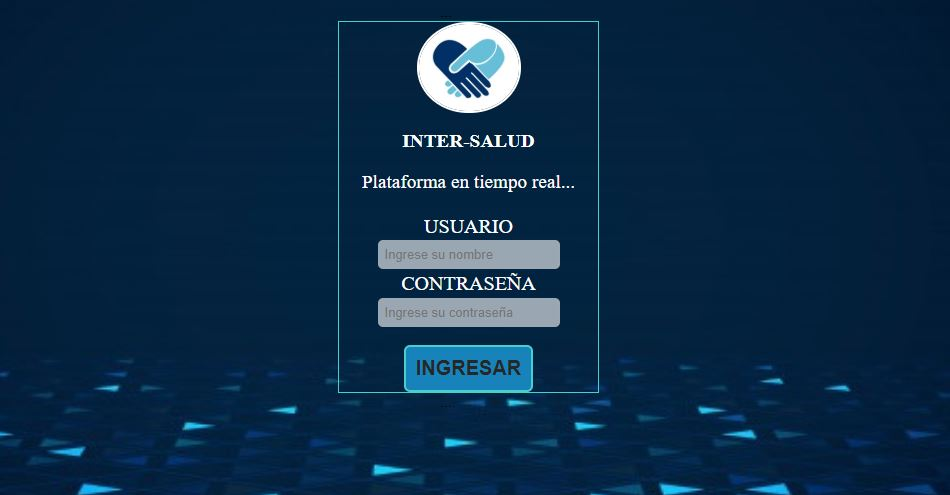
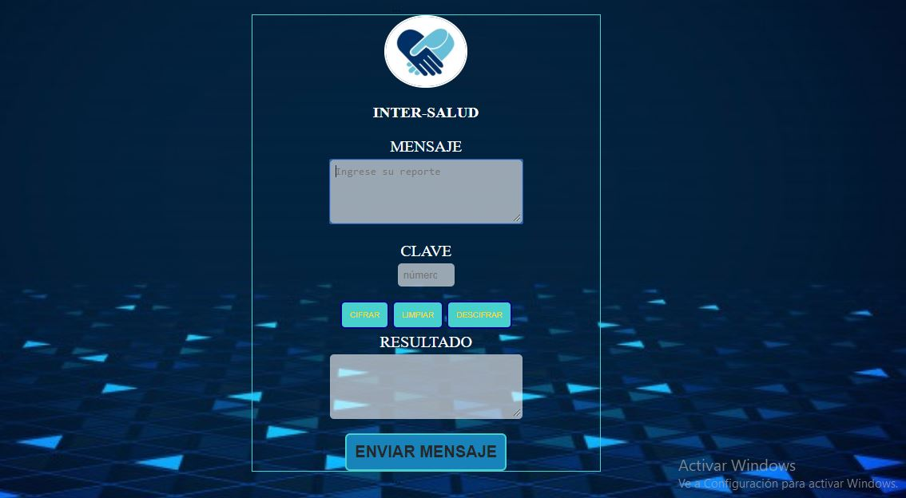
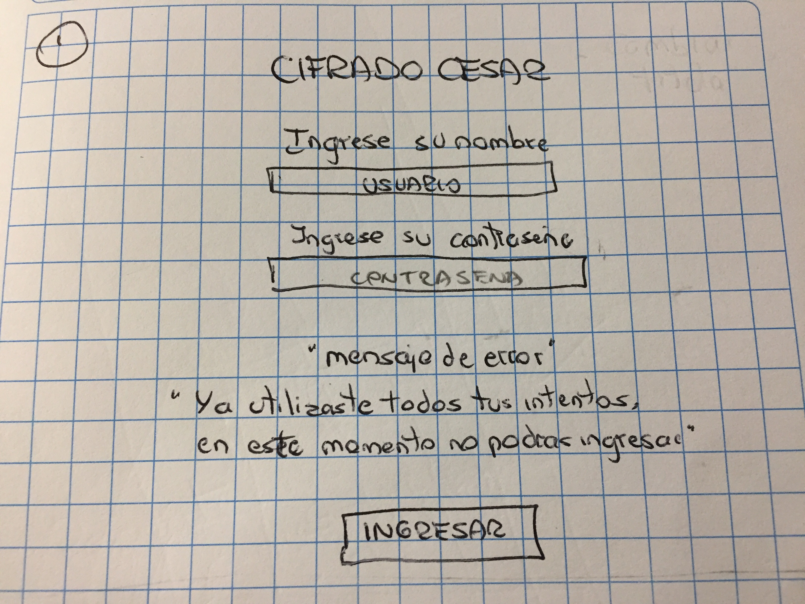
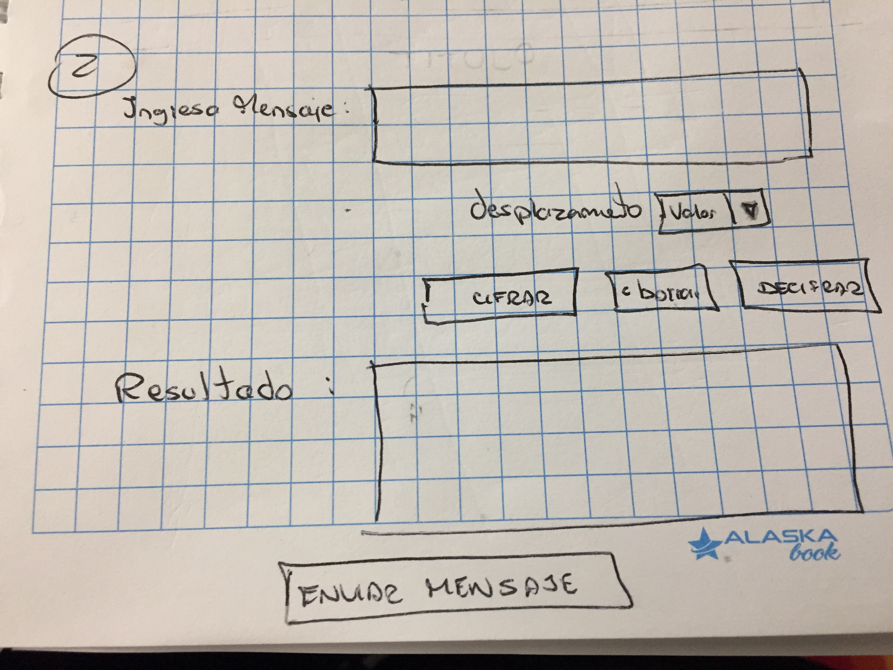
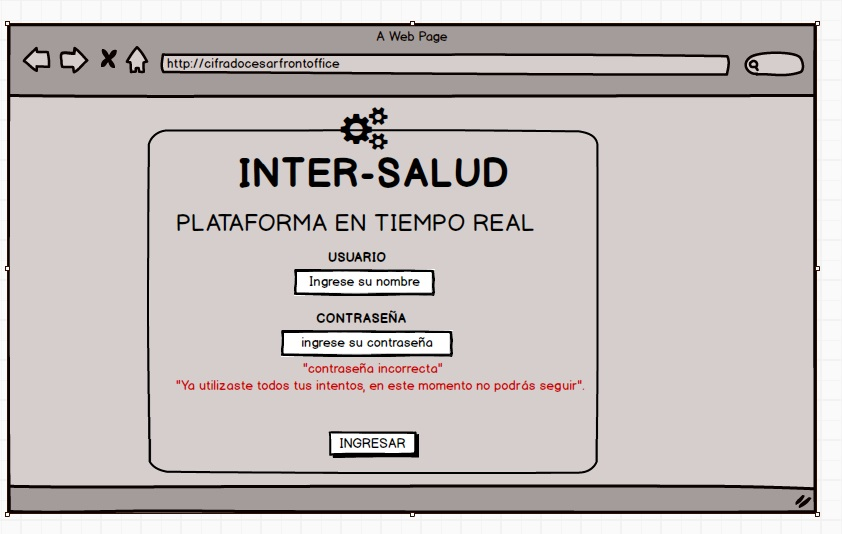
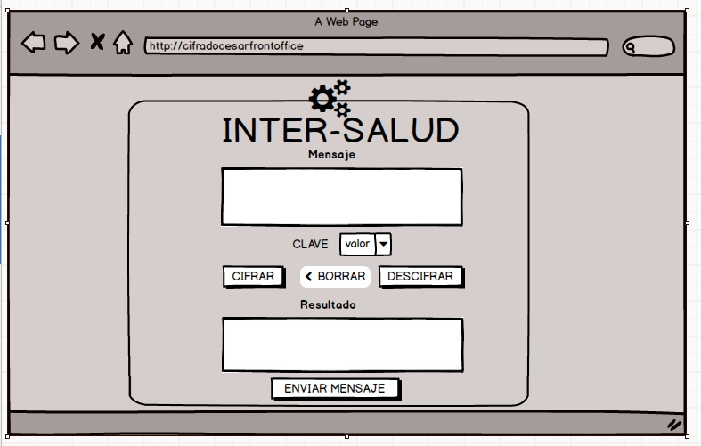

# INTERSEGURO

Esta herramienta permite la interacción en tiempo real de los colaboradores de la agencia con el área de soporte,a través de mensajes cifrados, para resolver los problemas en los procesos de pago(error en datos de usuarios, pagos nulos o vencidos) de los usuarios.

     

    
Las distintas operaciones del usuario que se realizan en la oficina de seguros están a cargo del Front Office. Dentro de estas operaciones están los registros, actualizaciones o cambios, baja de registros, pagos de subsidios y orientación general.  Sin embargo, durante el proceso de generación de pagos de subsidios, surgen distintas dificultades para poder culminar la operación, tanto a nivel técnico como informáticos, por lo que usualmente se tiene que cortar con la atención y reportar estos casos al área de soporte, según sea el caso, para que puedan ser solucionados en un plazo de 48 horas. Los casos de problemas de sistemas o informáticos, si necesitan de un plazo para poder ser solucionados. En cambio, existen casos de errores básicos que pueden ser manejados y solucionados de manera inmediata por el área de soporte de prestaciones económicas, pero por la falta de una herramienta que permita la comunicación fluida entre estas dos áreas se ve afectado el proceso y calidad de atención.

Ante todo ello, este proyecto fue diseñado pensando en  los colaboradores del Front Office, para mantenerse comunicados, en tiempo real, permitiendo cifrar o descifrar mensajes para así poder resolver los problemas que se presenten en los procesos diarios de pagos de subsidios. El objetivo es tener un mensaje cifrado con el cual tengan la seguridad de que no podrá ser decifrado a menos que compartan la llave, pues la información que se manejarà es considerada confidencial.
        
Esta herramienta permitirá que el colaborador pueda dar solución inmediata a los casos que se presenten, de la mano de la información que reciba del área. Habiéndose así evitado generar reportes innecesarios que retrasan y afectan la calidad de atención brindada.
 
Esta idea fue reflejada en un primer momento, asi:

El feedback que se recibió de los usuarios,para este caso, un grupo de colaboradores de las distintas agencias, luego de evaluar la propuesta indicaron:

. Asignar un título (relacionado al tema)
. Cambiar el orden del texto en el LOGIN
. Cambiar el “mensaje de error” por otro más claro   de acuerdo a la acción.
. Mantener el título en la segunda vista
. El cuadro de texto del mensaje debe especificar    qué datos ingresar
. Cambiar la palabra desplazamiento por “clave”

 

   